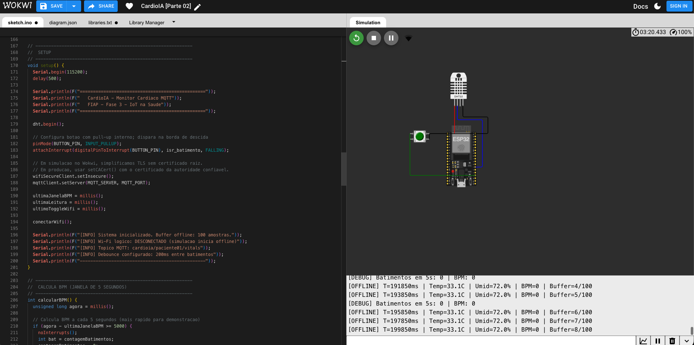
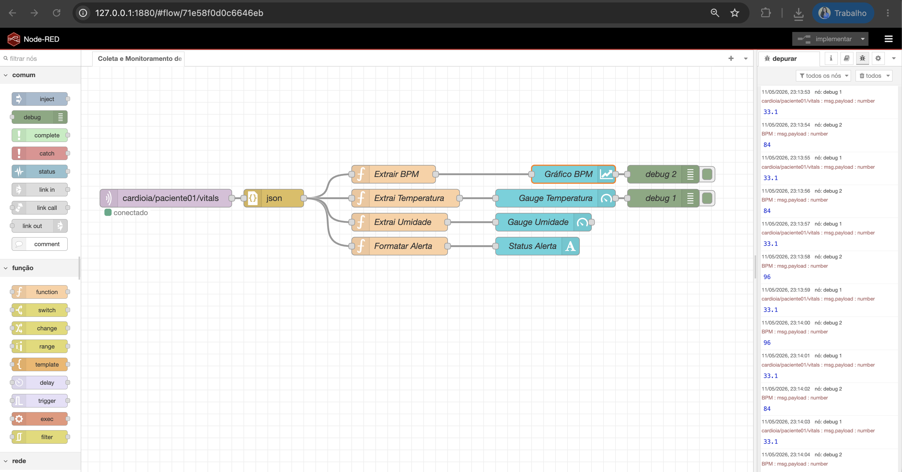
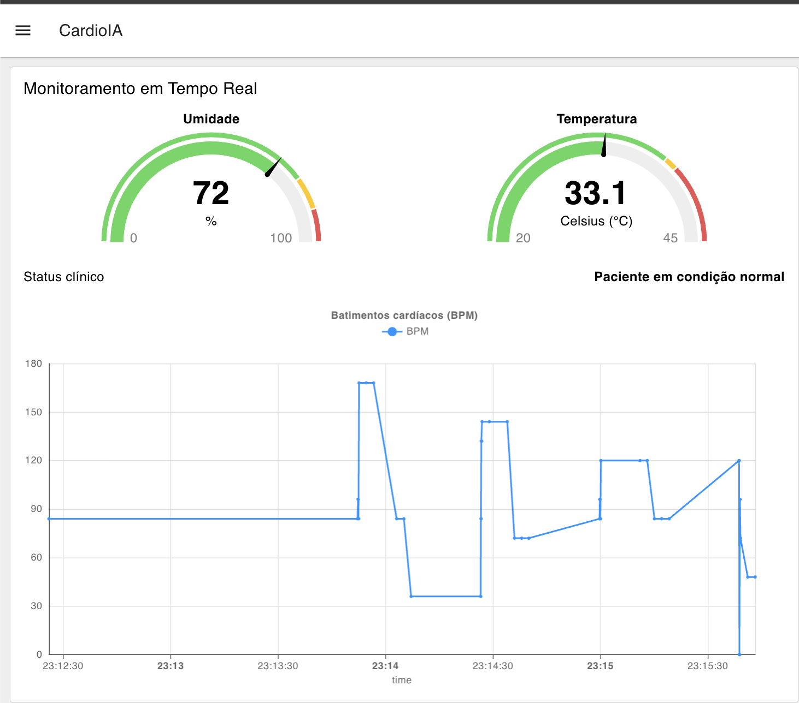

# CardioIA - Fase 3: Monitoramento Continuo IoT na Saude

**Equipe:**

- Amanda Vieira Pires (RM566330)
- Ana Gabriela Soares Santos (RM565235)
- Bianca Nascimento de Santa Cruz Oliveira (RM561390)
- Milena Pereira dos Santos Silva (RM565464)
- Nayana Mehta Miazaki (RM565045)

**Parte 2:** Transmissao para nuvem e visualizacao com MQTT, HiveMQ Cloud e Node-RED  
**Link Wokwi:** https://wokwi.com/projects/463766539506825217  
**Topico MQTT:** `cardioia/paciente01/vitals`

## 1. Visao Geral do Sistema

Nesta segunda parte do projeto CardioIA, a solucao desenvolvida na Parte 1 foi evoluida para integrar comunicacao MQTT real e visualizacao de dados em dashboard. A Parte 1 ja demonstrava os conceitos de Edge Computing: leitura de sensores no ESP32, calculo local de BPM, verificacao de alertas clinicos e armazenamento temporario em buffer circular durante periodos offline.

Na Parte 2, essa base foi preservada e a transmissao simulada via Monitor Serial foi substituida por publicacao MQTT no HiveMQ Cloud. Com isso, o prototipo passou a representar um fluxo completo de IoT aplicado a saude digital:

```text
ESP32/Wokwi -> HiveMQ Cloud -> Node-RED -> Dashboard
```

A solucao simula um dispositivo vestivel cardiologico capaz de capturar temperatura, umidade e batimentos cardiacos, publicar os dados na nuvem e exibir as informacoes em tempo real em um dashboard no Node-RED.

## 2. Arquitetura da Solucao

A arquitetura foi organizada em tres camadas principais:

| Camada | Tecnologia | Funcao no projeto |
|---|---|---|
| Edge Computing | ESP32 no Wokwi | Coleta sensores, calcula BPM, detecta alertas e armazena dados offline |
| Cloud Computing | HiveMQ Cloud | Atua como broker MQTT seguro para recebimento e distribuicao das mensagens |
| Fog/Visualizacao | Node-RED + Dashboard | Consome mensagens MQTT, processa o payload e exibe graficos, gauges e alertas |

Essa separacao demonstra a ideia central de IoT em saude: o dispositivo na borda nao depende da nuvem para continuar coletando dados. A nuvem atua como ponto de comunicacao, e a camada de visualizacao transforma os dados recebidos em informacao compreensivel para acompanhamento.

## 3. Componentes e Sensores Utilizados

O prototipo manteve os mesmos componentes da Parte 1, garantindo continuidade tecnica entre as entregas.

| Componente | Descricao | Pino ESP32 |
|---|---|---|
| ESP32 DevKit | Microcontrolador simulado no Wokwi | - |
| DHT22 | Sensor de temperatura e umidade | GPIO4 |
| Push Button | Simulador de batimentos cardiacos | GPIO15 |
| Buffer circular | Armazenamento temporario offline | 100 amostras em RAM |

O DHT22 foi mantido por ser o sensor obrigatorio da atividade e por fornecer dois parametros uteis ao monitoramento: temperatura e umidade. O botao representa um sensor cardiaco simplificado: cada pressionamento equivale a um batimento detectado. O codigo usa interrupcao e debounce de 200 ms para evitar leituras duplicadas causadas por ruido do botao.

O BPM e calculado a cada janela de 5 segundos. A cada 2 segundos, o sistema coleta uma nova amostra com timestamp, temperatura, umidade, BPM e status de alerta.

## 4. Fluxo de Comunicacao MQTT

O MQTT foi escolhido por ser um protocolo leve, baseado no modelo publish/subscribe e muito usado em IoT. Nesse modelo, os dispositivos nao precisam conhecer diretamente os consumidores dos dados. Eles publicam mensagens em topicos, e outros sistemas interessados assinam esses topicos.

No CardioIA, o fluxo implementado foi:

```text
ESP32 publica -> HiveMQ Cloud roteia -> Node-RED assina e recebe
```

O ESP32 atua como publisher. Ele publica os sinais vitais no topico:

```text
cardioia/paciente01/vitals
```

O HiveMQ Cloud atua como broker MQTT. Ele recebe as mensagens do ESP32 e as entrega para os clientes assinantes. O Node-RED atua como subscriber, assinando o mesmo topico para alimentar o dashboard.

Um ponto importante e que o ESP32 nao envia dados diretamente para o Node-RED. O desacoplamento ocorre por meio do broker. Isso torna a arquitetura mais flexivel: outros consumidores poderiam assinar o mesmo topico futuramente, como um banco de dados, uma API REST ou um sistema de notificacao.

## 5. Configuracao do HiveMQ Cloud

Foi utilizado um cluster Serverless no HiveMQ Cloud, acessado pela porta `8883`, que corresponde ao MQTT com TLS. Por seguranca, o codigo e o export do Node-RED usam placeholders no repositorio:

```text
SEU_CLUSTER_HIVEMQ.s1.eu.hivemq.cloud
SEU_USUARIO_MQTT
SUA_SENHA_MQTT
```

Para os testes, foram criadas duas credenciais separadas:

| Credencial | Permissao | Uso |
|---|---|---|
| `cardioia_esp32` | Publish only | Usada pelo ESP32 para publicar dados |
| `cardioia_nodered` | Subscribe only | Usada pelo Node-RED para consumir dados |

Essa separacao aplica o principio do menor privilegio. O ESP32 nao precisa assinar topicos, apenas publicar. O Node-RED nao precisa publicar comandos neste prototipo, apenas receber dados. Caso uma credencial seja exposta, o impacto fica limitado ao papel daquele componente.

No ESP32, a conexao com o HiveMQ foi feita com `WiFiClientSecure` e `PubSubClient`. Como a simulacao ocorre no Wokwi, foi usado `setInsecure()` para simplificar a validacao do certificado TLS. Em um dispositivo fisico de producao, o ideal seria usar `setCACert()` com o certificado da autoridade confiavel. No Node-RED, a configuracao TLS foi mantida com verificacao do certificado do servidor.

## 6. Payload JSON Publicado

Cada leitura e publicada em formato JSON, facilitando o processamento no Node-RED:

```json
{
  "deviceId": "cardioia-esp32-01",
  "ts": 12345,
  "temp": 33.1,
  "umid": 72,
  "bpm": 84,
  "alerta": false
}
```

| Campo | Significado |
|---|---|
| `deviceId` | Identificador do dispositivo |
| `ts` | Timestamp em milissegundos desde o boot |
| `temp` | Temperatura lida pelo DHT22 |
| `umid` | Umidade lida pelo DHT22 |
| `bpm` | Batimentos por minuto calculados a partir do botao |
| `alerta` | Booleano calculado localmente no ESP32 |

O uso de JSON facilita a integracao com Node-RED, dashboards e possiveis bancos de dados ou APIs futuras.

## 7. Resiliencia Offline e Sincronizacao

A logica de resiliência offline da Parte 1 foi mantida. O Wokwi utiliza a rede `Wokwi-GUEST` para permitir acesso real a internet e, portanto, permitir a conexao MQTT com o HiveMQ Cloud. Entretanto, o codigo tambem manteve a variavel logica `wifiConectado`, que simula a disponibilidade da transmissao do dispositivo.

Essa decisao separa dois conceitos:

- Wi-Fi do Wokwi: infraestrutura tecnica necessaria para MQTT real.
- `wifiConectado`: simulacao academica de conectividade online/offline do dispositivo.

Quando `wifiConectado` esta falso, o ESP32 continua coletando dados, mas armazena as amostras em um buffer circular de 100 posicoes. Quando a conectividade logica volta e o MQTT conecta, o sistema sincroniza primeiro as amostras pendentes e depois continua publicando as novas leituras.

A estrategia FIFO foi mantida: se o buffer encher, a amostra mais antiga e descartada para preservar dados mais recentes. Esse comportamento e importante em IoT medica, pois falhas temporarias de rede nao devem interromper a coleta local dos sinais.

## 8. Configuracao do Node-RED

O Node-RED foi instalado localmente e acessado pelo navegador em:

```text
http://127.0.0.1:1880/
```

Para a visualizacao, foi instalado o pacote:

```text
@flowfuse/node-red-dashboard
```

O dashboard final ficou disponivel em:

```text
http://127.0.0.1:1880/dashboard/page1
```

O fluxo principal implementado foi:

```text
mqtt in -> json -> functions -> widgets
```

O node `mqtt in` foi configurado para conectar ao HiveMQ Cloud pela porta `8883`, com TLS habilitado, e assinar o topico `cardioia/paciente01/vitals`. O node `json` converteu a mensagem recebida em objeto JavaScript. Em seguida, quatro functions separaram e formataram os dados para os widgets:

| Function | Funcao |
|---|---|
| Extrair BPM | Converte `data.bpm` para numero e define `msg.topic = "BPM"` |
| Extrair Temperatura | Converte `data.temp` para numero |
| Extrair Umidade | Converte `data.umid` para numero |
| Formatar Alerta | Converte `alerta` em mensagem textual para o dashboard |

A necessidade de usar `Number(...)` foi observada durante os testes, pois os gauges e o grafico interpretam melhor os dados quando o valor numerico chega explicitamente em `msg.payload`.

## 9. Configuracao do Dashboard

O dashboard foi montado com quatro elementos principais:

| Widget | Configuracao | Objetivo |
|---|---|---|
| Grafico BPM | Linha, eixo Y de 0 a 180, `action: append` | Exibir a evolucao temporal dos batimentos |
| Gauge Temperatura | Faixa de 20 a 45 °C | Exibir temperatura atual |
| Gauge Umidade | Faixa de 0 a 100% | Exibir umidade atual |
| Texto de alerta | Mensagem normal ou alerta clinico | Indicar situacao do paciente |

O grafico de BPM usa `msg.payload` como valor e `msg.topic = "BPM"` como serie. O modo `append` foi escolhido para acumular os pontos ao longo do tempo, permitindo visualizar a evolucao do sinal vital.

O gauge de temperatura foi configurado entre 20 e 45 °C. Essa faixa foi escolhida para comportar os valores gerados pelo DHT22 no Wokwi, como 24 °C ou 33.1 °C, sem usar uma faixa clinicamente incoerente como 0 °C para temperatura do paciente. As faixas de cor foram:

- Verde a partir de 20 °C.
- Amarelo a partir de 38 °C.
- Vermelho a partir de 39 °C.

O gauge de umidade foi configurado de 0 a 100%, com amarelo a partir de 80% e vermelho a partir de 90%. A umidade foi tratada como parametro ambiental auxiliar, relevante para conforto, respiracao e qualidade do ambiente ao redor do paciente.

## 10. Alertas Automaticos

Os alertas sao calculados no ESP32, antes do envio para a nuvem. Os limites usados foram os mesmos da Parte 1:

| Parametro | Limite | Justificativa |
|---|---|---|
| Temperatura | > 38 °C | Indicio de febre |
| Umidade | > 90% | Ambiente excessivamente umido |
| BPM | > 120 bpm | Possivel taquicardia em repouso |

Quando algum limite e ultrapassado, o campo `alerta` do JSON e enviado como `true`. No Node-RED, a function `Formatar Alerta` transforma esse valor booleano em texto:

```text
Paciente em condicao normal
```

ou:

```text
ALERTA CLINICO: limite excedido
```

Esse texto atende ao requisito de indicador visual de alerta no dashboard.

## 11. Evidencias dos Testes

**Figura 1 - Simulacao no Wokwi e Monitor Serial.**  
A imagem mostra o ESP32 no Wokwi executando o codigo da Parte 2. O Monitor Serial evidencia o calculo de BPM, a conexao ao HiveMQ Cloud, a alternancia para modo offline e o armazenamento da amostra no buffer.



**Figura 2 - Fluxo no Node-RED.**  
A imagem apresenta o fluxo configurado: entrada MQTT assinando o topico do HiveMQ, conversao JSON, functions de extracao de dados e widgets do dashboard. O painel de debug confirma o recebimento de valores como BPM e temperatura.



**Figura 3 - Dashboard final.**  
A imagem evidencia o dashboard em funcionamento, com gauges de umidade e temperatura, status clinico e grafico de BPM em tempo real.



Durante os testes, mensagens foram inicialmente confirmadas no Web Client do HiveMQ e depois no debug do Node-RED, validando o fluxo completo:

```text
ESP32 -> HiveMQ Cloud -> Node-RED -> Dashboard
```

Exemplo de payload recebido:

```json
{"deviceId":"cardioia-esp32-01","ts":37217,"temp":24,"umid":40,"bpm":0,"alerta":false}
```

Tambem foram observados valores no dashboard como temperatura de 33.1 °C, umidade de 72% e status "Paciente em condicao normal".

## 12. Conclusao

A Parte 2 do CardioIA demonstrou a integracao entre Edge, Cloud e Fog Computing em um fluxo completo de IoT para saude digital. O ESP32 simulou um dispositivo vestivel responsavel pela coleta e pelo processamento local dos dados. O HiveMQ Cloud funcionou como broker MQTT seguro, permitindo a transmissao dos sinais vitais para a nuvem. O Node-RED consumiu esses dados e os apresentou em um dashboard interativo, com grafico, medidores e alerta clinico.

A solucao atende aos requisitos da atividade ao enviar dados simulados do ESP32 via MQTT, configurar um broker em nuvem, montar um dashboard em tempo real e exibir alertas automaticos baseados em limites definidos pela equipe. Alem disso, a separacao de credenciais por permissao, o uso de TLS e a preservacao da logica offline reforcam boas praticas importantes para sistemas IoT aplicados a contextos de saude.
